# X86处理器架构

### 微机基本结构

##### 中央处理器CPU

- 寄存器

- 高频时钟

  涉及CPU和系统总线的每个操作都由一个内部时钟同步

  机器指令使用的最基本的时间单位称为机器周期或时钟周期

  机器指令的执行至少需要一个时钟周期

- 控制单元（CU）

- 算术逻辑单元（ALU）

CPU通过主板插槽的引脚与计算机的其他部分相连接

##### 内存存储单元

内存存储单元是计算机程序运行时存放指令和数据的地方

##### 输入/输出设备

I/O设备，如显示器、键盘、鼠标、硬盘等等

##### 三大总线

- 数据总线

  在CPU与外部之间传送指令和数据

- 控制总线

  使用数字信号，同步、控制接入到总线上的所有设备的动作

- 地址总线

  传输指令和数据的地址

### 指令执行周期

程序在开始执行之前必须装入内存

指令指针寄存器：存有要执行的下一条指令的地址

指令队列：存放着若干条要执行的指令

##### 执行步骤

取指令、解码、执行

若指令使用内存操作数，还需取操作数、存储输出操作数

- 取指令

  控制单元从指令队列中取出指令并递增指令指针

- 解码

  控制单元对指令进行解密以确定该指令要执行的操作

  控制单元将输入操作数传递给算数逻辑单元，并发送信号指明执行的操作

- 取操作数

  若指令的操作数在内存中，控制单元产生读内存操作从内存传入到内部寄存器

- 执行

  算术逻辑单元执行指令，以寄存器为操作数，将运算输出结果送到有名寄存器或内存中，然后更新处理器的状态标志

- 存储结果

  若结果要存储到内存，则执行写内存操作将结果存到内存中去

##### 多级流水线

指令执行的每一步至少占用一个时钟周期，处理器可以采用流水线技术来实现多个部件间的并行处理，以提高系统的效率。

486采用6级流水线，每级流水线有其对应的执行部件

- 总线接口单元BIU

- 代码预取单元

- 指令解码单元

- 执行单元

- 分段部件

  把逻辑地址转换为线性地址并进行保护检查

- 分页部件

  把线性地址转换为物理地址，进行页保护检查并保留最近访问页的列表

##### 超标量体系结构

有两条及以上的执行流水线

使得同时可以执行多条指令

### 内存读取

系统的吞吐量通常依赖于内存的访问速度

CPU时钟频率很高，通过系统总线的内存访问速度往往偏低，二者之间速度不匹配。一般要求快速设备插入等待周期以等待慢速设备

##### 内存操作周期

一个内存操作，往往需要多个时钟周期

- 周期1

  内存操作数的地址放到地址总线上

- 周期2

  读取控制总线设为读功能，通知存储器要读一个值

- 周期3

  CPU等待以便存储器做出响应，存储器响应好后，将选中单元里的数据放到数据总线上。若存储器未能把数据准备好，则要求CPU插入更多等待周期

- 周期4

  将读信号置1，通知CPU从数据总线上取数

##### 缓存

由于内存与CPU速度相差巨大，目前一般是采取缓存的方式来提高速度

缓存的存取速度比普通内存快得多

程序在第一次读取某数据时，将此数据范围内的一块内存数据读入并存放到缓存中。以后再操作此块内存时，不进行真正的内存操作，而在缓存中进行。

### 32位X86处理器

##### 操作模式

- 保护模式

  应用级程序能执行的指令较少

  不同程序间内存独立，一个程序不能访问其他程序的内存

  现代Windows和Linux等系统，CPU均设置在保护模式下工作

  从286开始引入保护模式的概念，此前的8086不具有这种工作模式

- 实地址模式

  8086的工作模式，无指令级别概念

  内存不独立，不同程序间可以相互访问对方内存，使得系统可能不稳定

  在DOS操作系统中，CPU工作在实模式

- 系统管理模式

- 虚拟8086模式

##### 执行环境

- 地址空间

  在32位保护模式下，一个任务或程序可以寻址4GB的线性地址空间——32位地址线能够表达的上线

  实地址模式下，只用到20根地址线，最大地址访问量是1M

  虚拟8086模式下，一个系统中可以运行多个虚拟的8086模式程序，每个程序拥有独立的1M地址空间

- 寄存器

  CPU内部的存储单元，访问速度比内存快得多

  8个32位通用寄存器：EAX、EBX、ECX、EDX、ESI、EDI、EBP、ESP

  8个16位通用寄存器：AX、BX、CX、DX、SI、DI、BP、SP

  前四个可对半分成两个8位寄存器AH、AL、BH、BL、CH、CL、DH、DL

- EAX寄存器

  EAX在乘法和除法指令中被自动使用，通常被称为扩展累加寄存器

- EBX寄存器

  基址寄存器，常用于地址索引

- ECX寄存器

  在某些指令中，CPU自动使用ECX作为循环计数器

- EDX寄存器

  数据寄存器，常用于数据传递

- ESI和EDI

  由高速内存数据传送指令使用，通常称为扩展源变址寄存器和扩展目的变址寄存器

  ESI通常与DS段配合使用，EDI通常与ES段配合使用

- ESP寄存器

  扩展堆栈指针寄存器，寻址堆栈上的数据，极少用于算术运算和数据传送

- EBP寄存器

  扩展帧指针寄存器，高级语言使用EBP指向堆栈上的函数参数和局部变量

- 6个16位的段寄存器

  实模式下，段寄存器用来存放段的基地址

  保护模式下，段寄存器存放段描述符的索引

  通常每个段寄存器有特定的用途：

  CS用于指向代码，SS用于指向堆栈，DS等其他段寄存器指向数据

- 指令指针寄存器EIP

  存放下一条要执行得指令的地址

  每执行完一条指令，CPU会自动修改EIP以指向下一条指令的地址

  不能用数据传送指令、算术指向等去修改EIP的值

- 标志寄存器EFLAGS

  由控制CPU的操作或反映CPU某些运算结果的独立的二进制位构成

  C：进位标志 A：辅助进位标志 P：奇偶标志 Z：零标志 S：符号标志 O：溢出标志 D：D=1自减 D=0增 I：I=0中断屏蔽 I=1中断不屏蔽 T：T=1置单步执行方式

### X86内存管理

##### 实地址模式

20位地址线

可以访问1M字节的内存

地址范围0-0FFFFFH

##### 保护模式

保护模式是一个强大的易用的处理器模式

地址线32根，可寻址4G空间

地址范围0-0FFFFFFFFH

保护模式使用内存的方式又分成平坦分段模式和多段模式

Windows平台下采用平坦分段模式，使用一个32位整数就可以存放任何指令和变量的地址

- 平坦分段模式

  所有段都映射到计算机的32位地址空间中

  一个程序至少包含两个段：代码段和数据段

  每个段都由一个段描述符来定义

  段描述符是一个64位的值，包括这个段的基址、段的长度及其他属性值

  多个段描述符几种存放在一片内存中，这片称为段描述符表，再通过一个寄存器GDTR指向这片内存的首地址

  段寄存器中存放的是段选择符

- 多段模式

- 分页

  分页机制实现线性地址到物理地址的映射

  页一般大小为4K

  通过一组转换表，把线性地址转换成物理地址

  一组连续的线性地址，可能被映射成不连续的物理地址

  分页机制便于实现虚拟内存

### 输入输出系统

应用程序通常从键盘和文件读取输入，并将输出写到屏幕或文件中。输入输出（I/O）不必通过直接访问硬件就能完成，通过直接调用操作系统的功能函数就能完成。有三种基本的访问层次：

- 高级语言的功能函数

  高级程序设计语言包含了执行输入输出的函数。这些功能函数都是可移植的，能够在多种不同的计算机系统上工作，并且不依赖于任何一个操作系统

- 操作系统

  通过API库调用操作系统的功能函数。操作系统提供了一些高级操作，如写字符串到文件、从键盘读取字符串以及分配内存块等

- BIOS基本输入输出系统

  直接同硬件设备交互的子程序的集合。BIOS是由计算机制造商安装的，同计算机硬件相匹配。操作系统通常同BIOS通信

Windows汇编编程，操作系统为了保护系统资源，不允许普通应用程序直接访问硬件资源

# 汇编语言基础

### 基本元素

##### 保留字

- 指令助记符，如mov、add
- 伪指令，用于告诉汇编器汇编程序的指令
- 属性，表示变量和操作数的大小和使用信息
- 运算符，在常量表达式中使用
- 预定义符号，汇编器内部使用

##### 标识符

程序员命名的符号，用于标识变量、常量、过程名或代码标号

标识符长度1-247个字符，默认大小写不敏感

第一个字符可以是字母、_、_@、?、$，不能是数字

不能与保留字同名

##### 伪指令

由汇编器识别并在编译时执行相应动作的命令，不在运行时执行

伪指令可用于定义变量、过程、宏、定义段等

每个汇编器都有一套自己的伪指令，不同汇编器可能差异较大

##### 指令

汇编语言中的指令是一条汇编语句，在程序被汇编后变成可执行的机器指令

一条汇编指令包括4个部分：标号（可选）、助记符、操作数、注释（可选）

- 标号：数据标号、代码标号

  充当指令或数据位置标记的标识符

  放在指令前的标号表示该条指令的起始地址；放在变量前的标号表示这个变量所在的起始地址

- 指令助记符

  一般是一个单词缩写，如mov、sub、jmp等

- 操作数

  一条汇编指令可能包含0-3个操作数

  操作数可能是寄存器、内存操作数、常量、I/O端口

  在有两个操作数的指令中，第一个操作数称为目的操作数，第二个操作数称为源操作数，指令通常会修改目的操作数的内容。

- 注释

  单行注释：以分号开始至行尾的内容

  多行注释：利用comment定义一个符号，符号间的内容为注释

### 汇编程序

编程者用文本编辑器创建一个ASCII文本文件，称作源文件

汇编器将源代码生成含机器码的文件，称作目标文件，目标文件不能执行（MASM）

链接器将目标文件连接生成可执行文件（LINK)。生成执行文件后，就可以按操作系统支持的方式启动执行

### 定义数据

##### 内部数据类型

- BYTE：字节
- SBYTE：带符号字节
- WORD：字
- SWORD：带符号字
- DWORD：双字
- SDWORD：带符号双字
- QWORD：四字

有无符号主要是方便程序员区分，汇编器并不区分有无符号

##### 数据定义语句

数据定义语句在内存中给变量分配存储空间，可以指定名字

```
[变量名] 数据类型伪指令 初始值
```

变量名可选，代表变量地址，汇编后用地址来区分

初始值：定义变量时需指定初始值，如果不想指定初始值，可以用问号代替

##### DUP运算符

使用一个整数表达式作为计数器，为多个数据项分配存储空间

```
V1 BYTE 10 dup(0)
```

##### 变量加法

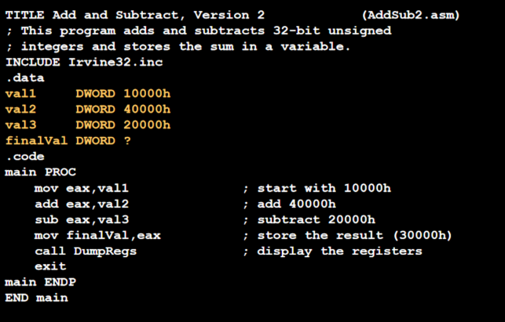


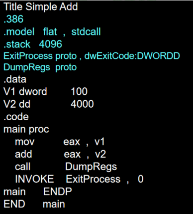

##### 小端顺序

Intel处理器使用小段顺序存储，变量的最低字节存储在最低地址单元，其他字节依次存储

如12345678h这个双字在内存中的存储情况

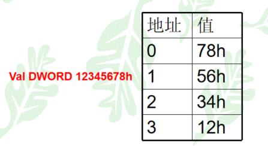

##### 未初始化数据的声明

- .data?伪指令用于声明未初始化的数据段

  在生成的执行文件中，未初始化段不占用文件的存储空间，有利于减少执行文件尺寸

- 混合代码与数据

  .data、.code 表示的数据段和代码段可以出现多次

  汇编器会把多个data整合到一起，多个代码段整合到一起

### 符号常量

通过为证书表达式或文本指定标识符来创建符号常量

符号不预留存储空间

相当于C语言里用define定义的宏

可以用 = 、 EQU 、 TESTEQU等三种方式进行创建

##### 等号伪指令

- 等号伪指令和证书表达式联系起来

  name = express

  表达式可以是32位的证书值，汇编预处理时，所有出现名字的地方都会替换为对应的表达式

```
COUNT = 500
mov ax,COUNT	;
//将生成并编译为mov ax,500
```

- 键值的定义

  程序中经常要为重要的键盘字符定义符号，如27H是ESC键的ASCII

- 使用DUP操作符

  ```
  Array DB COUNT dup(0)
  ```

- 重定义

  同一个程序中以 = 定义的符号可以重定义

##### EQU伪指令

- EQU伪指令把一个符号名与一个整数表达式或任意文本联系起来

  ```
  Name EQU expression	;	必须是有效的整数表达式
  Name EQU symbol	;		必须是已用 = 或 EQU定义的符号名
  Name EQU <test>	;		尖括号内可以是任意文本
  ```

- 不允许重定义

# 数据传送寻址和算术运算

### 数据传送指令

##### 操作数类型

- 立即操作数
- 寄存操作数
- 内存操作数

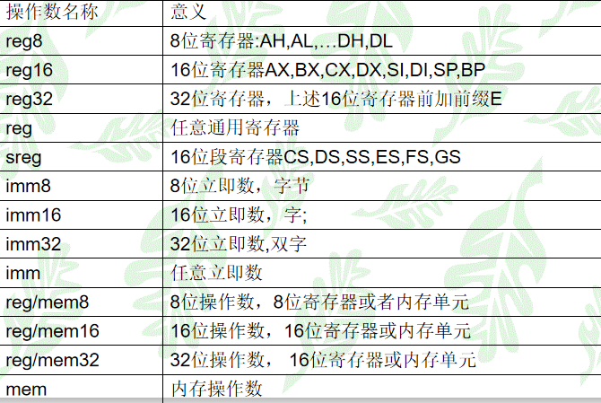

##### 直接内存操作数

变量名是该变量相对其所在的数据段开始处的偏移

```
.data
Var1 byte 10h
```

当指令使用内存操作数时，实际机器指令中使用的时操作数的地址（偏移量）

##### MOV指令

```
MOV dest,src
```

MOV指令有两个操作数，第一个为目的操作数，第二个为源操作数

其基本功能是将源操作数复制到目的操作数

**规则**

- 两个操作数的尺寸需一致
- 两个操作数不能同时为内存操作数
- 目的操作数不能是CS、EIP、IP
- 立即数不能直接送给段寄存器

**内存间的移动**

单挑MOV指令不能把数据从一个内存位置直接移动到另一个内存位置，需要借助寄存器实现

```
.data
Var1 word ?
Var2 word ?

.code
Mov ax,Var1
Mov Var2,ax
```

复制整数常量到变量或寄存器时需要考虑该变量需要的最小字节数

```
.data
oneByte BYTE 78h
oneWord WORD 1234h
oneDWord DWORD 12345678h

.code
mov eax,0
mov al,oneByte
mov ax,oneWord
mov eax,oneDWord
mov ax,0
```

##### 整数的0符号扩展

- MOVZX

  将高位补0，适用于无符号数

- MOVSX

  把符号位扩展到整个高位部分，适用于有符号数

目的操作数不支持内存操作数，不支持段寄存器

##### LAHF/SAHF

- LAHF

  将标志寄存器的低8位复制到AH寄存器

  被复制的标志包括符号标志、零标志、辅助进位标志、奇偶标志和进位标志

- SAHF

  将AH寄存器复制到标志寄存器的低8位

两条指令均无操作数

##### XCHG指令

将两个操作数的内容交换，操作数不可以是立即数

```
xchg ax,bx
xchg ah,al
xchg var1,bx
xhchg eax,ebx
```

**交换两个内存操作数**

```
Mov ax,var1
xchg ax,var2
mov var1,ax
```

##### 直接-偏移操作数

在变量名后加上一个偏移值，称作直接-偏移操作数

可以通过它来访问没有显示标号的内存地址

```
.data
arrayB byte 10h,20h,30,40

.code
mov al,arrayB	;al=10h
mov al,[arrayB+1]	;al=20h
mov al,arrayB+1	;
```

### 加法和减法

##### INC和DEC指令

INC加1，DEC减1

会影响到标志位（AF、OF、PF、SF、ZF），但不影响进位标志位（CF）

```
.data
myWord  WORD 1000h
myDword DWORD 10000000h
.code
	inc myWord 	; 1001h
	dec myWord	; 1000h
	inc myDword	; 10000001h

	mov ax,00FFh
	inc ax	; AX = 0100h
	mov ax,00FFh
	inc al	; AL=00h, AX = 0000h
```

##### ADD和SUB指令

将相同尺寸的源操作数和目的操作数相加，结果存到目的操作数

指令会修改CF、ZF、SF、OF、AF、PF

##### NEG指令

求数的补码（按位取反再加1）

求数的相反数（用0去减操作数）

指令会修改CF、ZF、SF、OF、AF、PF

```
.data
varB BYTE -1
varW WORD +32767

.code
	mov al,varB ;AL = -1
	neg al      ;AL = +1
	neg varW    ;varW = -32767
```

##### 影响的标志位

- 进位位（CF）

  用于判断无符号数有无溢出

- 溢出位（OF）

  用于判断有符号数有无溢出

- 零标志位（ZF）

  用于判断结果是否为0

- 符号位（SF）

  标识结果的正负

### AddSubTest

##### OFFSET操作符

返回数据标号的偏移地址，以字节为单位

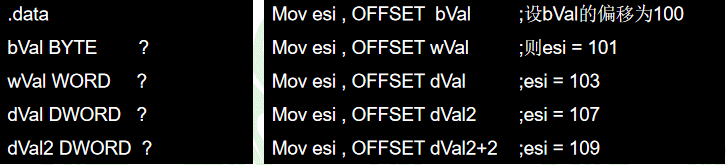

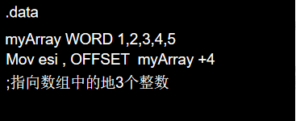

##### ALIGN

将变量的地址按指定的大小对齐

大小可以指定为1，2，4，8，16（.386只支持1，2，4），默认大小为1

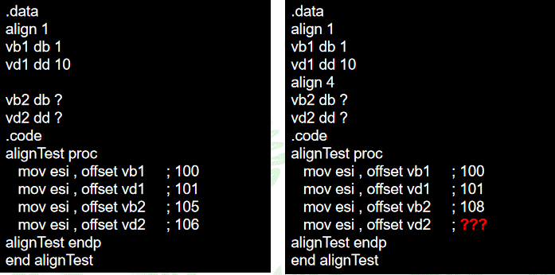

##### PTR

重载操作数声明的默认大小，类似于强制类型转换

```
.data
myDouble DWORD 12345678h

.code
	mov ax,word ptr myDouble
```

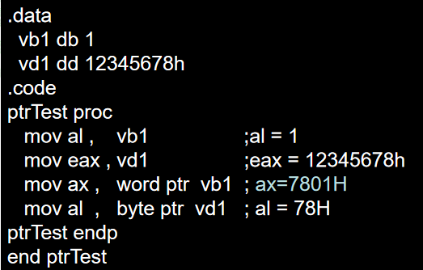

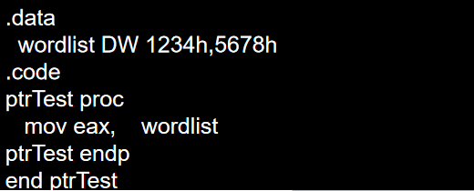

##### TYPE

返回按字节计算的变量的单个元素的大小

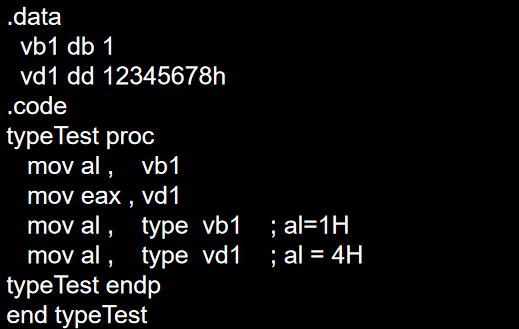

##### LENGTHOF

返回操作数的元素个数，只返回同一行的元素个数

如果声明的数组初值跨行，则只计算第一行的初值个数

如果初值的末尾是逗号，则会包含下一行的个数

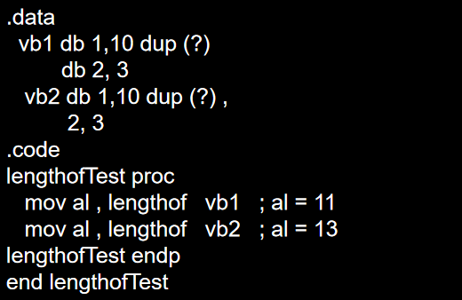

##### SIZEOF

返回操作数所占的字节数总数（LENGTHOF和TYPE返回值的乘积）

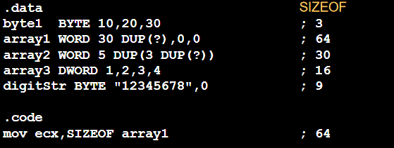

##### LABEL伪指令

为其后定义的变量提供一个别名以及一个不同的尺寸属性

它不会分配存储空间，不再需要PTR操作符

```
.data
dwList LABEL DWORD
wordList LABEL WORD
intList BYTE 00h,10h,00h,20h

.code
mov eax,dwList ;20001000h
mov cx,wordList ;1000h
mov dl,intList ;00h
```

### 间接寻址

利用寄存器内的值作为地址，访问操作数的方式称作间接寻址

```
mov ax,[si]	//用si寄存器中的值作为地址，访问该内存单元，取出值存到ax中
```

##### 间接操作数

用寄存器作为指针并操纵寄存器的值，称为间接寻址

操作数使用间接寻址时，称为间接操作数

任何一个32位通用寄存器加上括号就能构成一个间接操作数

- 保护模式

  间接操作数可以使用任意的32位通用寄存器

- 实模式

  只支持si、di、bx、bp四个寄存器作为间接寻址的寄存器

- 间接操作数可以是源操作数，也可以是目的操作数

**数组应用**

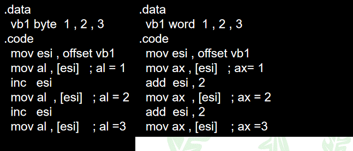

##### 变址操作数

把寄存器的值加上一个常量作为地址，访问内存操作数的方式，称作变址寻址

- 寄存器+变量名
- 寄存器+常数偏移量

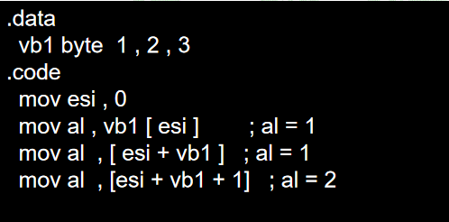

### JMP和LOOP指令

默认情况下，CPU按顺序执行指令

汇编语言通过控制转移改变语句的执行顺序，有两类控制转移指令

- 无条件转移

  JMP指令，相当于C语言中的goto语句

- 条件转移

  根据条件，跳到指定的地方，相当于C语言中的if语句

##### JMP指令

```
JMP 目的地址
```

接着从目的地址开始执行指令

- 目的地址一般为标号
- 通常在当前过程内跳转

##### LOOP指令

```
LOOP 目的地址
```

目的地址和当前地址只能相距-128-127之间，循环可以嵌套

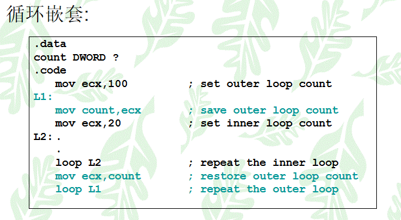

##### 数组求和

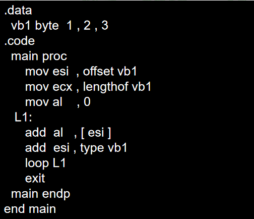

##### 复制字符串

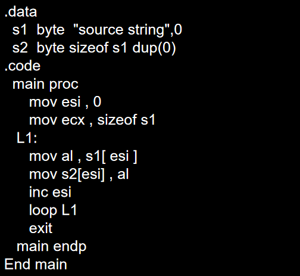

# 过程

### 堆栈操作

堆栈是CPU直接管理的内存数组，使用到两个寄存器：SS和ESP

保护模式下，SS段寄存器内存放的是用于寻找栈段的段描述符选择子，不应修改

ESP是指向栈的特定位置的一个32位偏移值，指向最后压入到栈的数据

堆栈只有一个出口，即当前栈顶，用堆栈指针寄存器ESP指定

栈顶是地址较小的一端，栈底不变


##### 堆栈的特点

- 堆栈操作的单位是双字
- 双字数据从栈顶压入和弹出时，都是低地址字节送低字节，高地址字节送高字节
- 堆栈操作遵循先进后出原则，但可用存储器寻址方式随机存取堆栈数据
- 堆栈常用来保存和恢复寄存器、临时存放数据、传递参数

##### PUSH

进栈指令先使堆栈指针ESP减4

将要压入的32位值拷贝到ESP指向的内存

```
PUSH r/m16
PUSH r/m32
PUSH imm32
```

对于32位操作数，ESP减4，存到栈中的内容为双字

对于16位操作数，ESP减2，存到栈中的内容为字

保护模式的立即数总是32位的

##### POP

将ESP指向的内存中的内容取出来，放到操作数中

将ESP+4

```
POP r/m16
POP r/m32
```

对于32位操作数，先从栈中拷贝双字到操作数中，然后ESP加4

对于16位操作数，先从栈中拷贝字到操作数中，然后ESO加2

##### PUSHFD和POPFD

- PUSHFD指令把32位的标志寄存器压入堆栈
- POPFD从堆栈中弹出32位值到标志寄存器中
- 两条指令均无操作数
- 实模式下标志寄存器为16为，入栈出栈指令为PUSHF、POPF

##### PUSHAD和POPAD

- 把八个32位通用寄存器按序全部压入堆栈
- 顺序：EAX、ECX、EDX、EBX、ESP、EBP、ESI、EDI
- POPAD以上反序从堆栈中依次弹出值到8个32位通用寄存器中
- PUSHA和POPA是上述寄存器对应的16位寄存器的入栈和出栈指令

##### 字符串反转

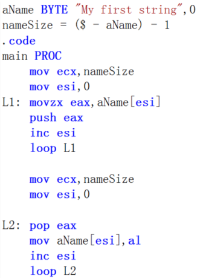

### 过程的定义和使用

将经常用到的应用问题编写成一个通用子程序

使用子程序可以使程序的结构更为清晰，程序的维护更为方便，有利于分工合作

##### 子程序指令

- 与主程序分开、完成特定功能的一段程序
- 主程序执行调用指令CALL调用子程序
- 子程序执行返回指令RET返回主程序

##### 向过程的传递参数

- 入口参数（输入参数）：主程序—>子程序
- 出口参数（输出参数）：子程序—>主程序

参数传递方法：寄存器、变量、堆栈

参数具体内容：数据本事、数据的存储地址

##### USES操作符

在定义过程时，可以在porc后跟uses操作符，然后再跟要保护的寄存器列表

指示汇编器在过程开始时添加压栈指令；在过程结束时加出栈指令

##### 寄存器保护原则

- 带有出口参数的寄存器不能保护和恢复
- 带有入口参数的寄存器可以保护也可以不保护，最好保持一致

##### 堆栈平衡

一个程序模块压入堆栈多少字节的数据，最终则应该弹出多少字节的数据，使得堆栈指针ESP的值不变

主程序CALL指令将返回地址压入堆栈，子程序RET指令将返回地址弹出堆栈

只有堆栈平衡，才能保证执行RET指令时，当前栈顶刚好是返回地址

### 链接到外部库

链接库是一种文件，包含了已经汇编为机器代码的过程

链接库开始是一个或多个源文件，这些文件再被汇编成目标文件

在汇编阶段，不再指定call指令的目标地址；在链接阶段，先在链接库中寻址WriteString，并把库中适当的机器指令复制到程序的可执行文件中

### Irvine链接库

##### 文件操作类

- CreateOutputFile
- OpenInputFile
- ReadFromFile
- WriteToFile
- CloseFile

##### 控制台窗口属性设置类

- Clrscr
- Crlf
- WaitMsg
- GetMaxXY
- Gotoxy
- GetTextColor
- SetTextColor

##### 调试信息输出类

- DumpMem
- DumpRegs
- MsgBox
- MsgBoxAsk

##### 输入输出类

- ReadChar
- ReadDec 
- ReadHex
- ReadInt 
- ReadKey 
- ReadString

##### 输入检查、转换类

- IsDigit
- ParseDecimal32
- ParseInteger32
- Str_length

##### 其他函数

- Delay
- GetMSeconds
- Randomize
- Random32
- RandomRange

# 条件处理

### 布尔和比较指令

##### CMP指令

目的操作数减去源操作数，不修改操作数的值，但会修改标志位的值 

**CMP的结果**

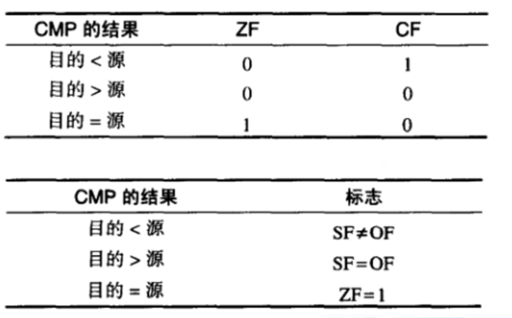

##### 置位和清除单个CPU标志位

- CF置位和清除方法

  STC指令：将CF置1	CLC指令：将CF清0

- ZF置位和清除方法

  test al,0 ;	置1

  and al,0 ;	置1

  or al,1 ;		清0

- SF置位和清除方法

  and al,7FH ;	清0

  or al,80h ;	置1

- OF置位和清除方法

  mov al,7Fh ;	

  inc al ;		置1

  xor al,0 ;		清0

### 条件跳转

```
Jcond destination
```

相当于 jmp if cond

当条件为真时，分支转移到目的地址处执行；条件为假时执行后面的指令

##### 基于特定标志位跳转

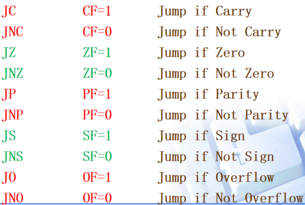

##### 基于操作数是否相等跳转

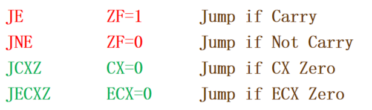

##### 基于无符号操作数比较结果

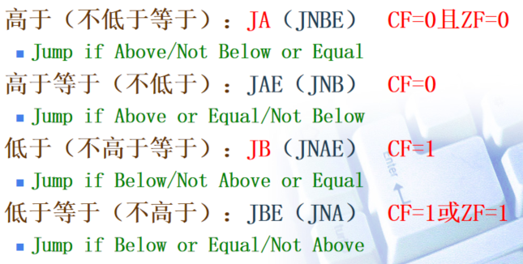

##### 基于有符号操作数比较结果

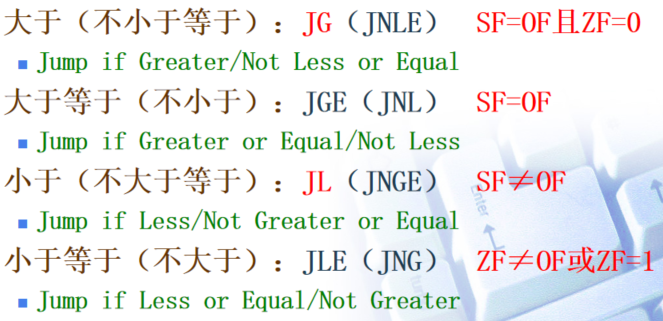

### 条件循环指令

##### LOOPZ指令

```
LOOPZ 目的地址
```

ECX不等于0且ZF标志位为1时跳转

目的地址与当前指令的距离在-128-127之间

##### LPPONZ指令

ECX不等于0且ZF标志位为0时跳转

##### IF语句

```
x dword ?
y dword ?

cmp x,y
jb S1
jmp S2
S1:statement-1
jmp:quit
S2:statement-2
jmp:quit
quit:
```

# 整数运算

### 移位和循环移位

位操作的指令分为移位指令和逻辑指令

移位的含义是将操作数向左或向右移动

IA-32共有十条移位指令，会影响溢出标志位和进行标志位

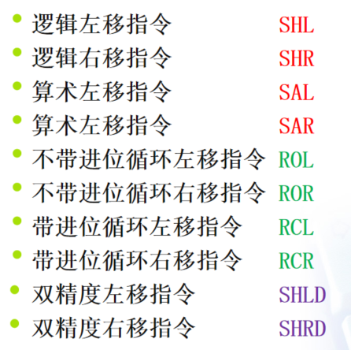

##### 逻辑移位和算术移位

- 逻辑移位：空出来的位用0填充
- 算术移位：空出来的位用符号位填充
- 左移无逻辑和算术差别，只有右移才有

**指令**

- SHL/SAL

  对目的操作数执行左移操作，最低位补0，移出的最高位送入进位标志CF

  ```
  SHL 目的操作数，移位位数
  ```

  当移位数不为1时，称作多次移位。对于多次移位，进位标志中的值是最后移出最高有效位的数据位

- SHR

  将目的操作数逻辑右移，左边空出的位添0，右边最低位被移出，复制到CF

- SAR

  将目的操作数算术右移，左边空出的位保持不变，右边最低位被移出，复制到CF位中

- ROL/ROR/RCL/RCR

  循环移位是从移出的位又送回到另一端

  循环移位不会丢失任何数据位

- 无符号数溢出

  逻辑左移：CF=1，溢出

  逻辑右移：CF=1，余数丢失

- 有符号数溢出

  当移动的位数是1位，且当数的符号位发生改变，就会将溢出位OF置位，否则清0

- SHLD/SHRD

  ````
  SHLD 目的操作数，源操作数，移位位数
  ````

  将目的操作数移位，源操作数自身值不改变

  左移时用源操作数的高位填充目的操作数的低位

  右移时用源操作数的低位填充目的操作数的高位

### 乘法和除法指令

乘除法运算对于有符号数和无符号数使用不同的指令

- 无符号

  乘法：MUL	除法：DIV

- 有符号

  乘法：IMUL	除法：IDIV

##### 无符号乘法

```
MUL reg/mem8
MUL reg/mem16
MUL reg/mem32
```

指令中只有一个操作数，另一个操作数是隐含的

- 当操作数8位时，表示这个8位数与AX相乘，结果放在AX中
- 当操作数16位时，表示这个16位数与AX相乘，高16位放DX，低16位放AX
- 当操作数32位时，表示这个32位数与EAX相乘，结果放在EDX和EAX中
- 当结果的高半部分非0时，CF和OF置位，否则清零

```
mov al,30h
mov bl,4h
mul b1 ;AX = 0C0H,CF = 0,OF = 0

mov ax,2000h
mov bx,100h
mul bx ;DX:AX = 0200 0000h,CF = 1,OF = 1
```

##### 有符号乘法

指令的操作数分成单操作数、双操作数、三操作数三种

**单操作数**

```
IMUL reg/mem8
IMUL reg/mem16
IMUL reg/mem32
```

若结果的高半部分不是低半部分的符号扩展，OF、CF置位

**双操作数**

```
IMUL r16, r/m16
IMUL r16, imm8
IMUL r16, imm16
IMUL r32, r/m32
IMUL r32, imm8
IMUL r32, imm32
```

两个操作数相乘，结果存到第一个操作数中

如果第一个操作数存不下结果，OF、CF置位

**三操作数**

```
IMUL r16, r/m16, imm8
IMUL r16, r/m16, imm16
IMUL r32. r/m32. imm8
IMUL r32, r/m32. imm32
```

两个操作数相乘，结果存到第一个操作数中

如果第一个操作数存不下结果，OF、CF置位

##### 无符号除法

```
DIV r/m8	AX / op8  = AL(商) …AH(余数)
DIV r/m16	DX:AX/op16 = AX…DX
DIV r/m32	EDX:EAX/op32=EAX…EDX
```

实现整除运算，结果包括两项：一项为商，一项为余数

```
mov ax,83h
mov b1,2h
DIV b1 ;AL=42H,AH=1

mov dx,0
mov ax,8003h
mov cx,100h
DIV cx ;AX=008H,DX=3h
```

##### 有符号除法

有符号在进行除法操作欠往往要进行符号扩展

共有三条符号扩展指令，其操作数在指令中不给出，均为隐含的寄存器

- CBW：将AL符号扩展到AH
- CWD：将AX符号扩展到DX
- CDQ：将EAX符号扩展到EDX

```
mov AL,-48
mov bl,5
cbw
IDIV bl ;AL=-9,AH=-3

mov ax,-5000
mov cx,256
cwd
IDIV cx ;AX=-19,DX=-136
```

在做除法时，如果商太大，目的操作数无法容纳，则会置位溢出位OF，引发中断

当除数为0时，也会引发中断，通常在做除法前，需要判断除数是否为0

### 扩展的加法和减法

##### ADC

带进位加

将两个操作数与进位位一起相加，结果存放到目的操作数中

##### SBB

带借位减

将目的操作数减去源操作数，再减进位位，结果存放到目的操作数中

# 高级过程

### 堆栈帧

CPU中用到堆栈的地方很多

- 通过PUSH和POP指令利用堆栈保存和恢复寄存器、变量等
- CALL利用堆栈存放地址供RET指令使用
- 使用堆栈传递子过程参数
- 利用堆栈实现局部变量

堆栈帧是一块堆栈保留区域，它是为传递的参数、子程序的返回地址、局部变量和保存的寄存器保留的堆栈空间

给子过程传递参数有两种基本方式

- 通过寄存器传递

  执行效率高、代码混乱、寄存器数量有限

- 通过堆栈传递

  方式灵活通用、效率偏低

##### 创建步骤

1. 如果有传递的参数，则压入堆栈
2. 子程序被调用，子程序的返回地址压入堆栈
3. 子程序开始执行时，EBP被压入堆栈
4. EBP设为ESP的值，EBP就被作为寻址所有子程序参数的基址指针使用
5. 如果有局部变量，ESP减去一个数值，以遍在堆栈上为局部变量保留空间
6. 如果任何寄存器需要保存，则压入堆栈

# 串操作

### 基本串操作指令

- MOVS
- CMPS
- SCAS
- STOS
- LODS

每个指令因处理对象的宽度不同，各有三个后缀B、W、D

这些指令都使用各自隐含的寄存器，源操作数由DS：ESI指向，目的操作数由ES：EDI指向。有的指令涉及到累加器，因处理宽度不同分别对应AL、AX、EAX

在保护模式下，ES和DS的值相同，且程序不能修改

##### MOVS

MOVS指令把ESI指向的内存内容复制到EDI指向的内存单元中

相当于mov [edi],[esi]

ESI和EDI两个寄存器的值同时增加或减少，如DF位为0则增加，否则减少

##### CMPS

将ESI指向的内存同EDI指向的内存相比较

相当于cmp [esi],[edi]

同时修改ESI和EDI的值

##### SCAS

SCASB指令将AL的值与EDI指向的内存内容相比较

相当于cmp AL,[edi]

即做查找操作

SCASW是用AX作字查找，SCASD是用EAX作双字查找

##### STOS

将累加器的内容存储到edi指向的内存单元中，同时修改edi的值

##### LODS

将从esi指向的内存内容取出存到累加器中，同时修改esi的值

##### 二维数组

基址变址寻址方式是把两个寄存器的值相加，得到的和作为偏移地址，两个寄存器第一个称作基址，另一个称作变址

在32位模式下，基址和变址可以使用任意通用32位寄存器

在16位模式下，基址只能是BX或BP，变址只能是SI或DI 

